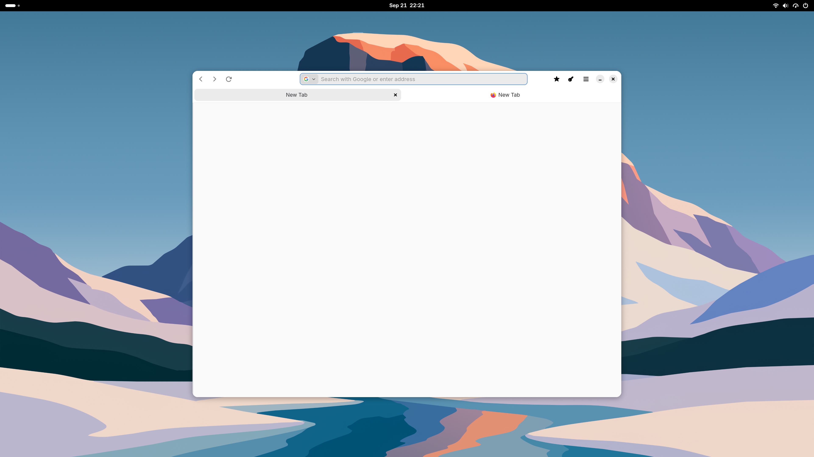

  

# FF-Gnome-Web

A simplified version of [Firefox GNOME Theme](https://github.com/rafaelmardojai/firefox-gnome-theme), with compatibility fixes for Firefox 154, 155 and 156, plus various visual glitch fixes.

Modified by [IzsakiRobi](https://github.com/IzsakiRobi). Many thanks to [rafaelmardojai](https://github.com/rafaelmardojai) for the wonderful original theme!

## Installation

1. Open `about:config` and set `toolkit.legacyUserProfileCustomizations.stylesheets` to `true`.
2. Open `about:profiles` and open your active profile’s **Root Directory**.
3. Copy the supplied `chrome` folder into that directory. Back up any existing `chrome` folder first.
4. Restart Firefox.

## Theme options

Create Boolean preferences in `about:config`; set to `true` to enable, then restart Firefox.

- `gnomeWeb.hidePageLoadingBar` - Hide loading indicator
- `gnomeWeb.hideSingleTab` - Hide the tab bar with one tab
- `gnomeWeb.normalWidthTabs` - Use standard Firefox tab widths
- `gnomeWeb.swapTabClose` - Swap tab close button position
- `gnomeWeb.bookmarksToolbarUnderTabs` - Place bookmarks below tabs
- `gnomeWeb.activeTabContrast` - Increase active tab contrast (dark mode)
- `gnomeWeb.closeOnlySelectedTabs` - Show close buttons only on selected tabs
- `gnomeWeb.systemIcons` - Use system theme icons
- `gnomeWeb.noThemedIcons` - Use default Firefox icons
- `gnomeWeb.symbolicTabIcons` - Use monochrome tab icons
- `gnomeWeb.hideWebrtcIndicator` - Hide the WebRTC indicator
- `gnomeWeb.hideUnifiedExtensions` - Hide the extensions toolbar button
- `gnomeWeb.dragWindowHeaderbarButtons` - Allow window dragging from headerbar buttons (experimental)
- `gnomeWeb.tabsAsHeaderbar` - Move tabs and window controls to the top
- `gnomeWeb.oledBlack` - Use black backgrounds in dark mode
- `gnomeWeb.allTabsButtonOnOverflow` - Show the all-tabs button on overflow
- `gnomeWeb.allTabsButton` - Always show the all-tabs button
- `gnomeWeb.tabAlignLeft` - Align tab icons and titles left
- `gnomeWeb.bookmarksOnFullscreen` - Show bookmarks in fullscreen

## License

[The Unlicense](LICENSE), inherited from the original project.
